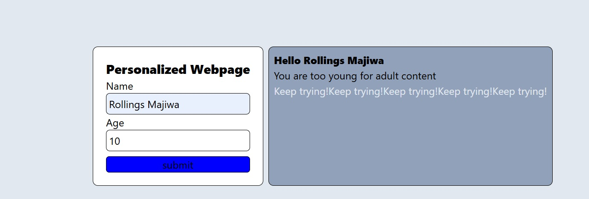

# Personalized Webpage

---

## 1. Project Brief

The *Personalized Webpage* is a modern, responsive web application designed for users who want a customized interactive experience. It provides a streamlined interface to process user inputs like names and ages, updating the interface dynamically to handle age-gated feedback and local user data caching.

---

## 2. Business Rationale

In a competitive digital space, user engagement and custom experiences are key. This project addresses two primary business needs:

* *Brand Authority:* A clean, semantic layout establishes a highly interactive environment, building confidence in data collection routines.
* *Data Collection:* The structured configuration ensures that raw input values, storage variables, and calculation metrics are captured and persistent across page refreshes.

---

## 3. Technologies used

* *HTML5:* Semantic structure for optimal accessibility and search indexing.
* *CSS3 and TailwindCSS:* For modern responsive layout, flex container alignments, and element spacing (linked via styles.css).
* *JavaScript (ES6):* Event listener handling, browser form default prevention, dynamic loop iterations, and client storage manipulation.

---

## 4. Accessibility features

* *Semantic HTML:* Using semantic structures alongside clear label parameters to aid assistive digital reading utilities.
* *List structures:* Interactive conditional outcomes and looped motivations are logically separated to provide an obvious reading path.

---

## 5. Product features

The application manages targeted functional parameters dynamically:

* *Personalized Greeting:* Extracts form elements locally to display contextual titles instantly.
* *Age Conversion Tracking:* Computes input metrics cleanly to present live calculation updates.
* *Dynamic Content Loop:* Implements systematic generation arrays to seamlessly print repeating elements downward into the DOM frame.

---

## 6. Git workflow

* *Fork the Repository:* Create your own copy of the project to work on.
* *Create a Feature Branch:*

```bash
git checkout -b YourFeatureName
```
* Commit your changes
* Push to branch
```bash
git push origin feature/YourFeatureName
```
*   o   pen a pull request. Describe your changes clearly and link the related issues.
## 7. Set up instructions
```bash
git clone [htps://github.com/rongingsmajiwa/personalized_webpage.git]
```
## 8. Screenshots



## 9. Author
Rollings Majiwa
* GitHub: https://github.com/rollingsmajiwa
* Email: rollingsmajiwa@gmail.com

## Get Started
Interested in code behind Personalized Webpage? You can reach me directly via my profile. [Visit my github profile](htps://github.com/rongingsmajiwa/personalized_webpage.git)